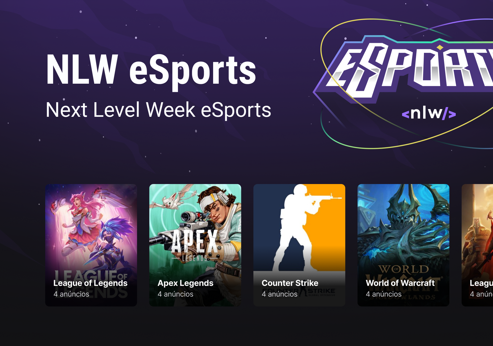

<h1 align="center">
  
</h1>

<h1 align="center">
  
</h1>

# Sobre o projeto

<p>
  Projeto criado durante o evento NLW da @Rocketseat do dia 11/09/2022 à 18/09/2022. O projeto é voltado para o mundo gamer, a idéia é achar um parceiro(a), se conectar através do Discord e marcar um horário para jogar.
</p>

# Tecnologias

- [Vite](https://vitejs.dev/)
- [TypeScript](https://www.typescriptlang.org/)
- [ReactJs](https://reactjs.org/)
- [React Native](https://reactnative.dev/)
- [NodeJs](https://nodejs.org/en/)
- [Express](https://expressjs.com/pt-br/)
- [Expo](https://expo.dev/)
- [Phosphor React](https://github.com/phosphor-icons/phosphor-react)
- [Radix UI](https://www.radix-ui.com/)
- [TailwindCSS](https://tailwindcss.com/)
- [Prisma](https://www.prisma.io/)
- [Sqlite](https://www.sqlite.org/index.html)

## Como baixar o projeto

```bash
# Clonar o repositório
$ git clone https://github.com/wellingtonrodriguesbr/nlw-esports.git

# Entrar no diretório
$ cd nlw-esports


## Instalar as dependências ##
# Web
$ npm install

# Server
$ npm install

# Mobile
$ npm install

## Rodar o projeto ##
# Web
$ npm run dev

# Server
$ npm run dev

# Mobile
$ expo start
```

<br/>
<hr/>

<p align="center">Desenvolvido por <a href="https://www.linkedin.com/in/wellingtonrodriguesbr/" target="_blank">Wellington Rodrigues</a> ✌🏽</p>
